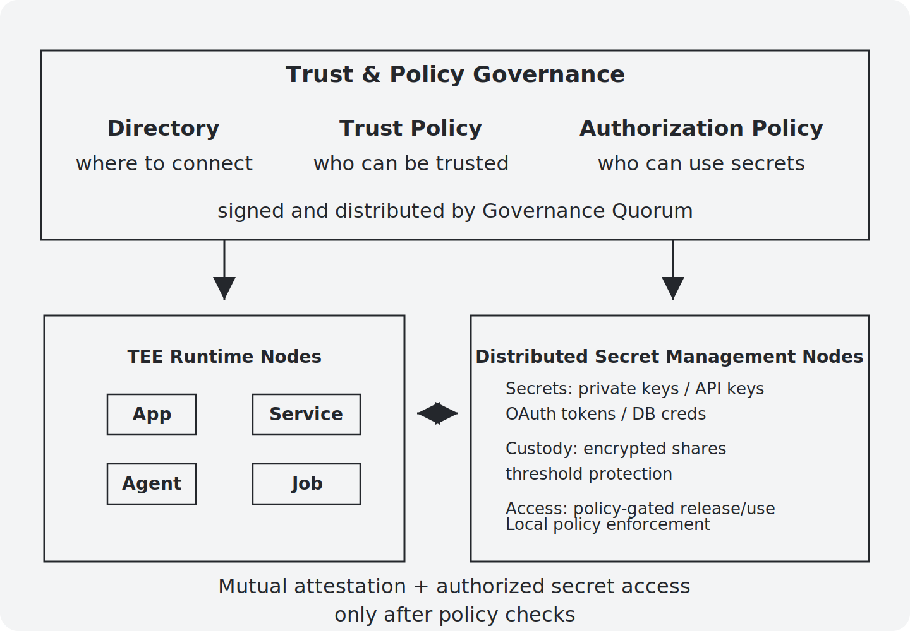

# TEENet

**Open-source trust stack for protected secrets and verifiable actions**

TEENet uses Trusted Execution Environment (TEE) hardware to build an attested node network for protected secret use and verifiable critical actions.

At the system layer, TEENet protects how sensitive operations happen: which code is allowed to use a secret, where that code runs, how control is split across nodes, what result was produced, and what proof can be checked later.

## Start Here

| Repository | Status | Purpose |
| --- | --- | --- |
| [TEENet](https://github.com/TEENet-io/teenet) | Coming soon | Canonical entry point for architecture, trust model, roadmap, examples, and contribution guidance. |
| [TEENet SDK](https://github.com/TEENet-io/teenet-sdk) | Developer preview | Go and TypeScript SDKs for signing, verification, API secrets, Passkey approval, and local mock development. |
| [TEENet Wallet](https://github.com/TEENet-io/teenet-wallet) | Alpha | An application-layer wallet for agents and automation, built on TEENet-protected signing and policy enforcement. |

## Why TEENet

Many applications need software to use secrets that should not be exposed directly to one service, one operator, or one administrator.

The hard part is not only storing a secret. The hard part is making sure a sensitive operation is performed by the right workload, inside the right trust boundary, under the right owner-controlled authorization, with evidence that can be verified later.

TEENet is being built for developers who want this trust path to be open, self-owned, and composable.

## What TEENet Does

TEENet gives applications a system layer for protected secret use and verifiable critical actions.

With TEENet, an application can:

- run approved code in a protected execution environment;
- bind secret use to approved code and a specific application;
- split secrets into threshold shares across separate TEE-backed nodes;
- require multiple TEE-backed nodes to participate in signing or credential-backed operations, without exposing the secrets themselves;
- produce verifiable logs for operations;

TEENet does not define the application's business rules. It protects the lower-level trust path applications rely on.

## Architecture Overview

TEENet separates policy governance, protected application runtime, and distributed secret management. All nodes shown in the diagram are TEE nodes. Communication between these node groups must go through mutual attestation, and the attestation process includes policy checks.

- **Directory** tells nodes where to connect. It is routing information, not a source of trust.
- **Trust Policy** defines which TEE nodes can be trusted. Governance, runtime, and secret management nodes evaluate it locally as part of mutual attestation.
- **Authorization Policy** defines which apps can use which secrets. Secret management nodes enforce it before releasing or using a protected secret.

The governance quorum signs and distributes policy updates from TEE-backed governance nodes. Runtime trust decisions still happen directly between nodes using attestation evidence and locally cached policies.

## Design Principles

- **Separate application policy from system trust.** Apps define business rules; TEENet protects the secret use and execution path.
- **Self-owned first.** Developers should be able to run, inspect, and adapt the trust stack themselves.
- **Verify before relying.** Critical actions should produce evidence, not just logs.
- **Reduce single points of trust.** Threshold design and attestation should narrow what any one operator can control.
- **Build for real integrations.** TEENet should make hard applications easier to ship, not only provide abstract security primitives.
